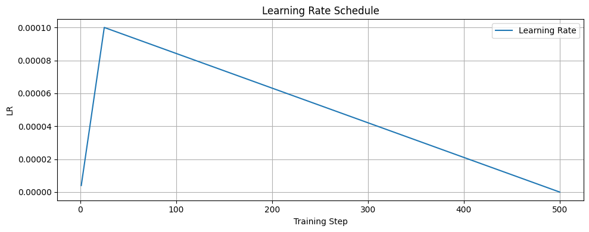
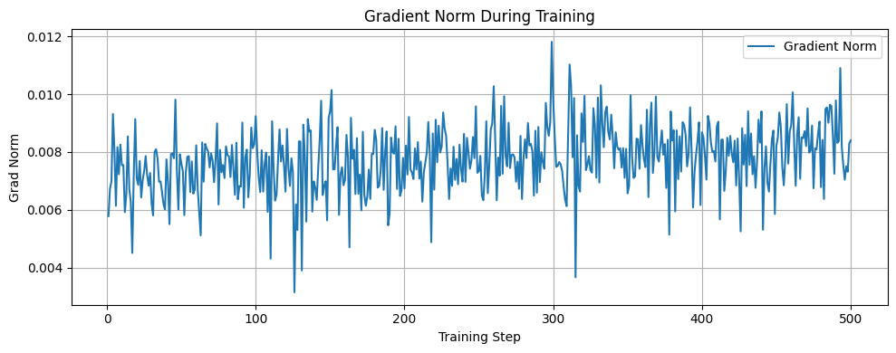
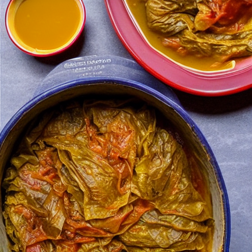
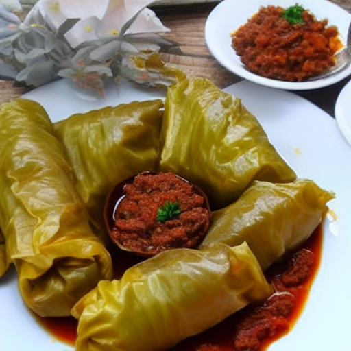
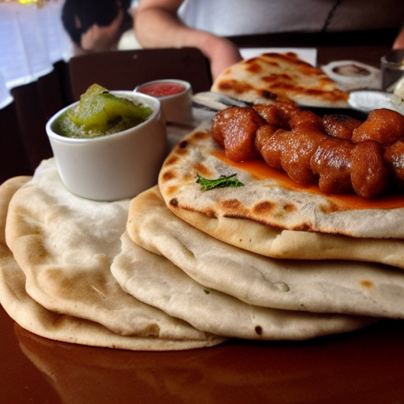
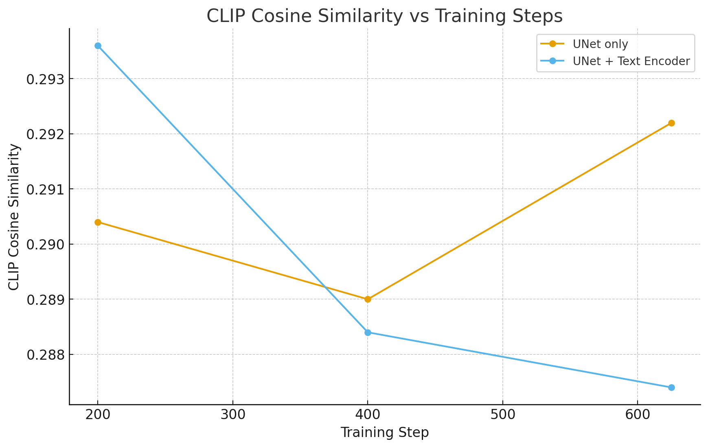
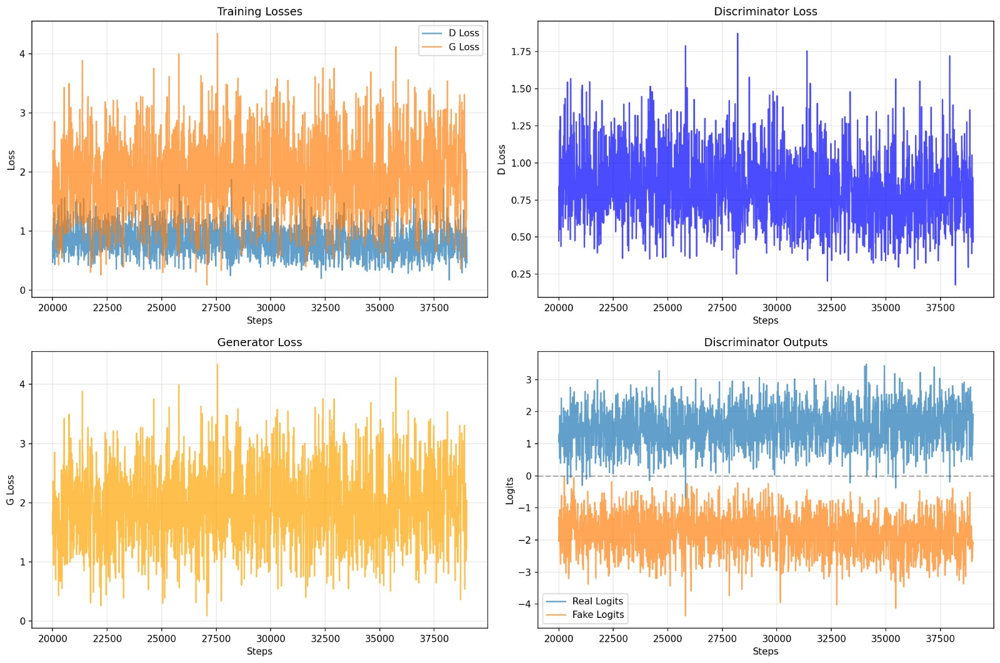
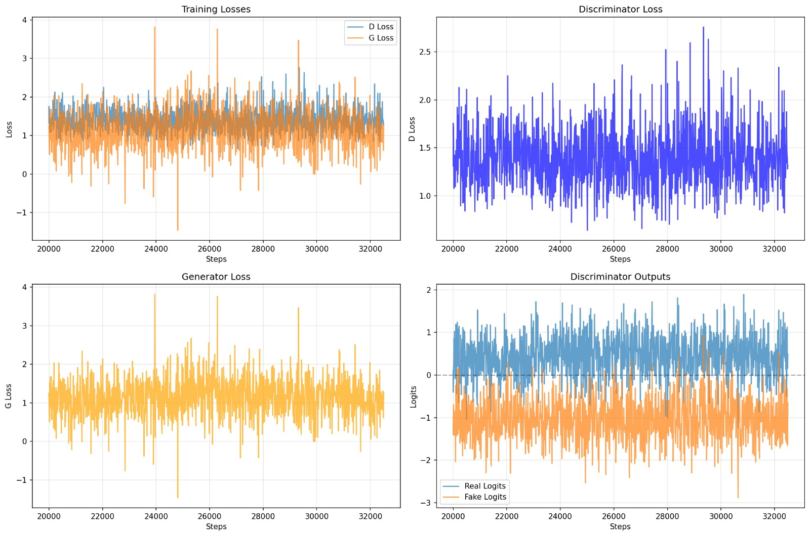
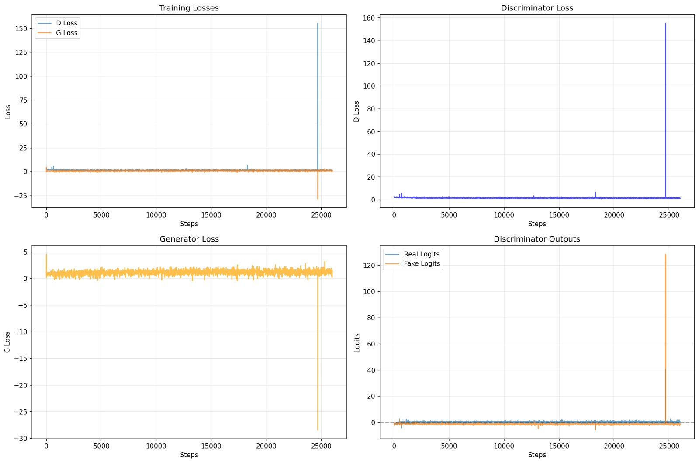

# Serbian Dish Image Generator

This project aims to generate realistic images of Serbian dishes based on short text captions. Three models are being experimented with on the same dataset:
1. LoRA-fine-tuned Stable Diffusion
2. CVAE-based model (placeholder)
3. GAN-based model (placeholder)

The project is structured as follows:
- `data_pipeline/`: scripts for data collection, cleaning, preprocessing
  - `scraping/`: recipe scraping scripts from recepti.com and coolinarika.com
  - `preprocessing/`: image cleaning, cropping, resizing, and caption preparation
- `models_pipeline/`: scripts for training and evaluating models
  - `sd_lora/`: LoRA training and evaluation for Stable Diffusion
  - `cvae/`: placeholder for CVAE model
  - `gan/`: placeholder for GAN model

All models share the **same dataset** of Serbian dishes, consisting of ~1,000 image-caption pairs. Captions were generated using GPT-4o-mini based on scraped **dish name, ingredients, and preparation**, to produce a short description of dish appearance used as input for training and generation.

The dataset is split into **training and testing subsets** to allow evaluation and metric computation.

---

## 🗂 Data Collection & Preprocessing

### 1. Scraping
- Recipes were collected from **recepti.com** and **coolinarika.com** using custom scraping scripts in `data_pipeline/scraping/`.
- Data scraped included: **image, dish name, ingredients, preparation steps**.
- Only publicly available recipes were used.
- Images were downloaded and mapped to their corresponding dishes.

### 2. Cleaning & Cropping
- Duplicates, corrupt images, and irrelevant data were removed.
- Images were cropped/resized to square format (512×512) suitable for training.
- Scripts are located in `data_pipeline/preprocessing/`.

### 3. Caption Generation
- Captions were generated with GPT-4o-mini using the dish name, ingredients, and preparation steps.
- Each caption describes the dish appearance, e.g.:  
  > "Sarma, a traditional Serbian dish of cabbage rolls served in a clay pot."
- No ingredient lists were included in the final caption; focus is on visual representation.

---

## 🧠 LoRA Fine-Tuned Stable Diffusion

### 📍 Base Model
- **`runwayml/stable-diffusion-v1-5`**: strong generation quality, compatible with LoRA fine-tuning.

### 🧩 Why LoRA?
- Fine-tunes only a small fraction of weights (Low-Rank Adaptation).  
- Benefits:
  - Lightweight training and modular weight files  
  - Fast training on Google Colab T4 GPUs  
  - Avoids catastrophic forgetting of base SD knowledge  
  - Flexible training: **UNet-only** or **UNet + Text Encoder**

### 🔧 Training Setup
- **Device:** Google Colab T4 GPU  
- **Precision:** Mixed precision (fp16) via 🤗 Accelerate  
- **Memory optimization:** xFormers enabled if available  
- **Gradient accumulation:** supports small batches efficiently  
- **Checkpoints & weight saving:** UNet and Text Encoder LoRAs stored separately  
- **Training script location:** `models_pipeline/sd_lora/train_sd_lora.py`  
  - Can train only UNet, or UNet + Text Encoder, configurable via a flag in the script.

### 🧾 Dataset Input Format
- Each training example: **image + caption pair** (~1,000 total)  
- Captions are short descriptive sentences (no ingredient lists).  
- Dataset split: **training set** and **testing set** for evaluation  
- Guides the model to generate visually accurate representations.

### 🍽️ What LoRA Learns
| Component | Focus | Effect |
|-----------|-------|-------|
| UNet LoRA | Visual features: textures, plating, colors, presentation | Produces realistic Serbian food imagery |
| Text Encoder LoRA | Semantic understanding of dish captions | Better alignment of caption meaning to visual output |
| Combined | Full visual + semantic alignment | Strong, consistent generation results |

### 📈 Training Dynamics

During training, several key metrics were monitored to ensure stable and effective learning:

#### Training Loss
The training loss was tracked throughout the process, showing the model's learning progress:


The graph shows three curves:
- **Raw Loss** (light blue): Individual batch losses showing natural variation
- **EMA Loss** (orange): Exponential Moving Average providing a smoothed trend
- **Rolling Average (100 steps)** (green): 100-step rolling average for medium-term trends

**Key observations:**
- Initial loss starts around 0.12 and quickly stabilizes
- EMA and rolling average converge around 0.16-0.17 after ~50 steps
- Relatively stable loss throughout training indicates good learning rate and proper convergence
- No signs of divergence or instability

#### Learning Rate Schedule
A linear learning rate warmup followed by cosine decay was employed:



**Schedule details:**
- **Warmup period:** 10 steps (0 to 0.0001)
- **Peak learning rate:** 0.0001 (1e-4)
- **Decay strategy:** Cosine annealing to near-zero
- **Final learning rate:** ~0 at step 500

This schedule ensures:
- Smooth initial adaptation (warmup)
- Stable training in the middle phase
- Fine-grained refinement toward the end (decay)

#### Gradient Norm
Gradient norms were monitored to detect potential training instabilities:



**Key observations:**
- Gradient norms remain consistently in the range of 0.004-0.012
- No gradient explosions or vanishing gradients observed
- Occasional spikes (e.g., around step 300) are normal and don't indicate problems
- Stable gradients throughout training suggest appropriate learning rate and good batch normalization

**Training stability:** The consistent gradient magnitudes across all 500+ steps demonstrate that the model learned effectively without encountering numerical instabilities, overfitting, or underfitting issues during this phase.

### 🖼️ Visual Examples — Before vs After LoRA

| Caption | Before LoRA | After LoRA |
|---------|-------------|------------|
| "Sarma, a traditional Serbian dish of cabbage rolls served in a clay pot." |  |  |
| "Ćevapi served with flatbread and onions." |  |  |

### 📊 Evaluation Metrics
Metrics are computed using captions and corresponding images from a subset of about 100 test samples, comparing generated images to ground-truth images with FID, CLIPScore, and CLIP cosine similarity to evaluate visual quality and semantic alignment.

#### Metrics Explained
- **FID (Fréchet Inception Distance):** measures distribution similarity between generated and real images (lower is better)
- **CLIPScore:** measures semantic alignment of caption and generated image on a 0-100 scale (higher is better)
- **CLIP cosine similarity:** measures alignment of text and generated image embeddings on a -1 to 1 scale (higher is better)

#### Results Across Training Steps

| Component | Training Step | FID ↓ | CLIPScore ↑ | CLIP cosine similarity ↑ |
|-----------|---------------|-------|-------------|--------------------------|
| UNet only | step 200 | 165.4340 | 64.52 | 0.2904 |
| UNet only | step 400 | 158.3018 | 64.45 | 0.2890 |
| UNet only | step 625 | 165.0374 | 64.61 | 0.2922 |
| UNet + Text Encoder | step 200 | 155.1722 | 64.68 | 0.2936 |
| UNet + Text Encoder | step 400 | 164.5307 | 64.42 | 0.2884 |
| UNet + Text Encoder | step 625 | 162.5785 | 64.37 | 0.2874 |

#### Metrics Visualization

| FID | CLIPScore | CLIP cosine similarity |
|-----|-----------|------------------------|
|  |  |  |

#### Analysis & Conclusions

**UNet-only vs UNet + Text Encoder:**
- Training the Text Encoder alongside the UNet provides a **small performance boost in early training** (around step 200), improving both FID and text-image alignment
- As training continues beyond step 200, these gains **diminish and even reverse**, suggesting mild overfitting or instability when the Text Encoder is trained too long on a small dataset
- **UNet-only LoRA remains more stable** across steps, with less fluctuation in metrics

**Training duration observations:**
- All three evaluation checkpoints (200, 400, 625 steps) show relatively similar performance
- The model converges quickly, with most learning happening in the first 200 steps
- Extended training beyond 400 steps shows minimal improvement and may introduce slight degradation

**Recommendations:**
- For small datasets (~1,000 samples), training only the UNet provides **more stable and consistent results**
- Training the Text Encoder can be beneficial but should be **applied carefully with early stopping** (around step 200)
- Checkpoints around **step 200-400 offer the best balance** between performance and training stability

### 🚀 How to Use This LoRA
```python
from diffusers import StableDiffusionPipeline

base_model = "runwayml/stable-diffusion-v1-5"
pipe = StableDiffusionPipeline.from_pretrained(base_model, safety_checker=None).to("cuda")

# Load LoRA weights (UNet or both)
pipe.load_lora_weights("models_pipeline/sd_lora/outputs/final/unet")
# pipe.load_lora_weights("models_pipeline/sd_lora/outputs/final/text_encoder")

prompt = "Sarma, a traditional Serbian dish of cabbage rolls served in a clay pot"
image = pipe(prompt).images[0]
image.save("output.png")
```

### 🧪 Additional Experiment: Extended Training on Larger Dataset

#### Training Configuration
In an additional experiment, LoRA was trained using:
- **Dataset size:** ~7,000 image-caption pairs (7× larger)
- **Training steps:** 1,000 steps (2× longer)
- **Fine-tuning target:** Both UNet and Text Encoder
- **Training duration:** Extended training phase for deeper adaptation

#### Quantitative Results
- **FID:** 113.2364 (**↓31.8% improvement** from ~165 baseline)
- **Average CLIPScore:** 64.13 (0-100 scale)
- **Average CLIP cosine similarity:** 0.2827 (-1 to 1 scale)

The **significant FID improvement** indicates that the generated image distribution is much closer to the real dataset distribution when trained on a larger dataset with more training steps.

#### Qualitative Analysis: Overfitting Observation

Despite improved quantitative metrics, **qualitative visual inspection reveals signs of overfitting**:

**Symptoms observed:**
- Generated images **closely replicate visual patterns, textures, and composition** from training data
- Dishes appear **too similar to specific training samples** rather than novel interpretations
- **Reduced visual diversity** when generating multiple images from the same prompt
- Loss of creative variation in plating, angles, and presentation

**Root causes:**
- The model learned **dataset-specific visual features too strongly**
- Extended training (1,000 steps) with both UNet and Text Encoder led to **memorization over generalization**
- Larger dataset provides more patterns to memorize, paradoxically increasing overfitting risk without proper regularization

#### Overfitting Example: Ćevapi

The following example illustrates overfitting behavior, where generated images strongly resemble specific training samples rather than producing novel variations:

| Caption | Generated Image |
|---------|-----------------|
| "Ćevapi served with flatbread and chopped onions." |  |

Notice how the generated image:
- Matches the exact plating style of training images
- Reproduces specific lighting and angle patterns
- Shows limited variation from known training examples

#### Key Takeaways

| Aspect | Finding | Recommendation |
|--------|---------|----------------|
| **Dataset Size** | Larger datasets improve FID but increase overfitting risk | Use datasets >5,000 images with proper regularization |
| **Training Duration** | 1,000 steps leads to memorization | Stop training around 400-600 steps for small-to-medium datasets |
| **Component Training** | Training both UNet + Text Encoder intensifies overfitting | Consider UNet-only for datasets <5,000 images |
| **Evaluation Approach** | Quantitative metrics alone are insufficient | **Always combine numerical metrics with qualitative visual inspection** |

**Conclusion:** While increasing dataset size and training duration improves FID scores, excessive fine-tuning—especially of both UNet and Text Encoder—can lead to overfitting. Visual realism improves at the cost of diversity and generalization. The **optimal training approach balances convergence with generalization**, requiring careful monitoring of both quantitative metrics and qualitative outputs.

---

## ⚡ CVAE Model
*Details to be added*

## ⚡ cGAN Model

### 📍 Architecture Overview
A conditional Generative Adversarial Network (cGAN) implementation for text-to-image generation of Serbian dishes, using CLIP embeddings for conditioning.

### 🏗️ Model Components

#### Generator
- **Architecture:** ResNet-style with Conditional Batch Normalization
- **Input:** Random noise (128D) + CLIP text embedding (768D from ViT-L/14)
- **Conditioning:** CLIP embeddings processed through MLP (768→512→256)
- **Structure:** Progressive upsampling 4×4 → 8×8 → 16×16 → 32×32 → 64×64 → 128×128
- **Activation:** ReLU in hidden layers, Tanh output (normalized to [-1, 1])
- **Key Feature:** Conditional BatchNorm where γ and β parameters are generated from text embeddings

#### Discriminator
- **Architecture:** Convolutional with ResNet blocks and spectral normalization
- **Input:** Images (128×128) + CLIP text embeddings (768D) for conditioning
- **Structure:** Progressive downsampling through ResNet blocks with average pooling
- **Conditioning:** Text embeddings projected and combined with image features via dot product
- **Output:** Real/fake classification logits

#### CLIP Integration
- **Model:** ViT-L/14 with laion2b_s32b_b82k pretrained weights
- **Embedding dimension:** 768D (enhanced over standard 512D for better semantic representation)
- **Usage:** Generates text embeddings for both training conditioning and inference

### 🔧 Training Configuration

#### Hyperparameters
- **Batch size:** 4 (optimized for T4 GPU memory constraints)
- **Base channels:** 32 (reduced from 64 for GPU memory efficiency)
- **Learning rates:** Generator 5×10⁻⁵, Discriminator 1.5×10⁻⁴ (conservative for stability)
- **Optimizer:** Adam with β₁=0.0, β₂=0.9
- **Training iterations:** 100,000 steps
- **Gradient clipping:** Norm 1.0 to prevent training instability

#### Advanced Training Techniques
- **R1 Gradient Penalty:** λ=2.0 for discriminator regularization
- **Exponential Moving Average (EMA):** Decay rate 0.999 for stable inference
- **Spectral Normalization:** Applied to all discriminator layers for training stability
- **Differentiable Augmentation:** Random augmentations to prevent discriminator overfitting

#### Hardware Requirements
- **GPU:** NVIDIA RTX 5060 Ti (optimized for consumer GPU constraints)
- **Precision:** Mixed precision (fp16) for memory efficiency
- **Memory optimization:** Reduced batch size and channel count for GPU compatibility

### 📈 Training Dynamics

#### Loss Monitoring & Training Progress
The model was successfully trained for **~40,000 iterations** with comprehensive loss tracking:


*Early training phase (0-7k steps) showing initial convergence and stabilization*


*Stable training phase (20k-23k steps) with balanced adversarial dynamics*


*Extended training phase (20k-37k steps) demonstrating consistent performance*


*Final training phase (~32k steps) showing maintained stability*

#### Key Training Observations:
- **Generator Loss:** Maintained in optimal range 0.5-2.0 throughout training
- **Discriminator Loss:** Stable oscillation around 1.0-1.5, indicating balanced training
- **Real Logits:** Consistently positive (0.5-1.5) showing proper real image classification
- **Fake Logits:** Maintained negative values (-1.5 to 0) demonstrating effective fake detection
- **Training Stability:** No catastrophic failures or mode collapse observed

#### Training Instability Prevention

*Example of training instability that was successfully avoided through careful hyperparameter tuning*

#### Training Stability
**Good signs observed:**
- Stable loss curves without explosion (>5) or collapse (near 0)
- Balanced adversarial dynamics between generator and discriminator
- Consistent gradient magnitudes throughout training

**Prevention of common issues:**
- Conservative learning rates prevent discriminator overpowering
- Gradient clipping avoids training instabilities
- EMA provides stable inference weights separate from training dynamics

### 🎯 Training Results

#### Model Checkpoints
- **Training duration:** ~40,000 iterations on RTX 5060 Ti
- **Checkpoint frequency:** Every 10,000 steps with sample generation
- **Optimal convergence:** Achieved around 30,000-35,000 steps
- **Final model:** Stable convergence with balanced adversarial dynamics

#### Sample Quality Evolution
Generated samples showed progressive improvement throughout training:
- **Visual realism:** Enhanced texture detail and color accuracy
- **Text alignment:** Improved semantic correspondence with Serbian dish descriptions
- **Semantic understanding:** Better comprehension of cultural food terminology
- **Consistency:** Stable quality across different prompts and generation runs

#### Generated Samples Gallery

*Grid of generated Serbian dishes showing diverse food types: sarma, ćevapi, pljeskavica, gulaš, and traditional stews. Generated using the trained cGAN model with various text prompts.*

### 🚀 Inference Usage

#### Text-to-Image Generation
```bash
python src/gan/inference_prompt.py \
    --checkpoint runs/cgan_768d/ckpt_0040000.pt \
    --prompt "traditional Serbian ćevapi with onions"
```

#### Interactive Generation
```bash
python src/gan/inference_prompt.py \
    --checkpoint runs/cgan_768d/ckpt_0040000.pt \
    --interactive
```

#### Key Features
- **Automatic CLIP model detection:** Matches training configuration from checkpoint
- **Proper text preprocessing:** OpenCLIP tokenization compatible with training
- **EMA weights usage:** Higher quality outputs using stable averaged weights
- **Flexible output:** Individual images and grid generation options

### 📊 Architecture Advantages

#### vs Standard GANs
- **Controllable generation:** Text conditioning enables specific dish generation
- **Higher semantic fidelity:** CLIP embeddings provide rich semantic conditioning
- **Better training stability:** Conditional architecture reduces mode collapse

#### vs Other Approaches
- **Faster than Diffusion:** Single forward pass vs iterative denoising
- **More controllable than VAE:** Adversarial training produces sharper details
- **Domain-specific:** Optimized for food image generation with cultural context

### 🔍 Implementation Highlights

#### Conditional Batch Normalization
```python
class CondBN(nn.Module):
    def forward(self, x, y):
        h = self.bn(x)
        g = self.gam(y).unsqueeze(-1).unsqueeze(-1)  # γ from text
        b = self.bet(y).unsqueeze(-1).unsqueeze(-1)  # β from text
        return h * (1 + g) + b
```

#### Text-Image Feature Fusion
```python
def forward(self, x, e):
    # x: image features, e: text embeddings
    h = self.conv_out(h)
    h = torch.sum(h, dim=(2,3))
    out = self.lin(h) + torch.sum(self.embed(e) * h, dim=1, keepdim=True)
    return out
```

### 🛠️ Training Scripts
- **Main training:** `src/gan/train_with_plotting.py` with loss visualization
- **Inference:** `src/gan/inference_prompt.py` for text-to-image generation
- **EMA implementation:** `src/gan/ema.py` for training stability
- **Data loading:** `src/gan/dataset.py` for image-embedding pairs

### 📋 Key Insights
1. **768D CLIP embeddings** provide significantly better conditioning than 512D
2. **Conservative hyperparameters** are essential for stable GAN training
3. **EMA weights** dramatically improve inference quality over raw training weights
4. **Memory constraints** require careful architecture scaling for consumer GPUs
5. **Text conditioning** enables precise control over generated dish characteristics

The cGAN implementation demonstrates effective text-to-image synthesis for Serbian cuisine, achieving stable training and high-quality conditional generation through careful architectural choices and training optimization.
